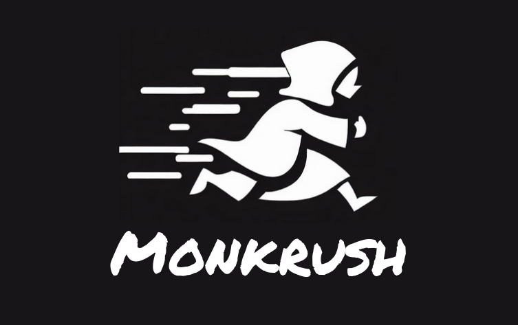

# Monkrush

Monkrush is a simple, ultra-scalable micropayment system.

## How does Monkrush work?

Monkrush combines the core ideas behind simplex payment channels with optimistic rollups. 

Users of the protocol deposit/withdraw into the system from/to any chain using Connext, and run a client to create, update and settle unidirectional channels with a counterparty.

### Key Design Principles

1. **Store Agnosticism:** The protocol, which leverages a combination of onchain and offchain state, makes no assumptions as to where offchain data is stored. In other words, it is up to integrators to define and import their own stores through a fixed interface.
2. **Transport Agnosticism** The protocol makes no assumptions about the networking layer or message transport used to pass messages between peers. In other words, the protocol can be used the exact same way over http, webrtc, tcp, libp2p, etc.
3. **Consolidated Protocol Logic:** Historically, payment channel protocols feature a combination of onchain + offchain data structures and message generation/verification logic. Monkrush instead defines the *whole protocol* as a solidity smart contract, with offchain-data logic implemented as simple stateless functions and emulated in the client at runtime.
4. **Chain and Asset Agnosticism:** Infrastructure protocols that rely on micropayments live in a variety of different environments (chains/rollups or their own independent networks) and leverage a number of different tokens. Monkrush attempts to remain as flexible as possible by enabling depositing/withdrawing from the protocol in a single transaction across chains using Connext. The protocol also supports any asset out of the box.

Through the above, Monkrush:
- Keeps up with your scale requirements (as these will be almost entirely defined by your store and networking performance).
- Retains 100% stability, even in poor network conditions. simplex channels constrain failure modes to almost none.
- Is flexible enough for any infrastructure project, regardless of their underlying tech stack.

### Architecture

The system is made up of:
1. An OP Stack rollup
2. A solidity contract that implements the protocol
3. A stateless Go client that wraps interactions with the contract running on the rollup.

[Diagram]

## Using the Protocol

Users integrating the protocol must do the following:
1. Set up a store that matches the [required interface].
2. (For optimal performance) run a node for the Monkrush rollup.
3. Connect the client to your store and rollup node.
4. Use the client to deposit into the rollup and set up channels.
5. Use the client to generate payment packets (if the peer is a sender), or verify payment packets (if the peer is a receiver).
6. Use the client to settle channels using the latest payment packet and withdraw from the rollup.